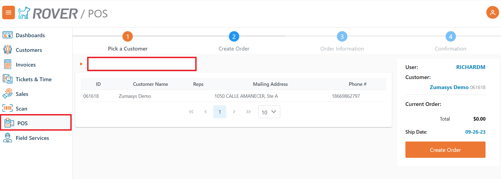
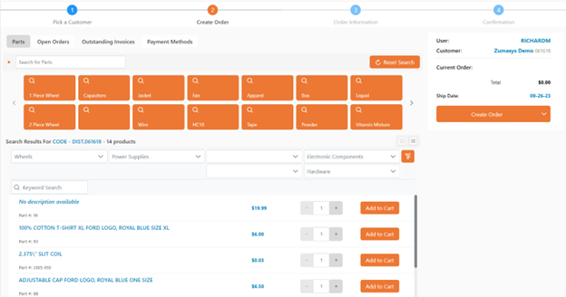
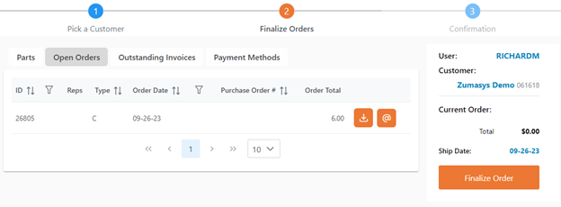
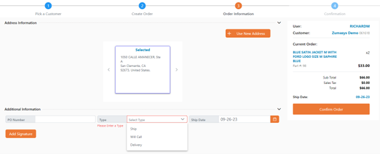

# Rover POS Overview

<PageHeader />

**Read Time:** 10 minute(s)

A new version of Rover is here! Rover POS allows you to interact with Rover in a POS environment through our new web client.  Make sales and move inventory between different customers through an easy-to-follow web interface.

## Getting Started

We can start the Rover Pay process by selecting POS on the left most menu.  It will open up a new screen that will allow you to select the customer you wish to sell to. You can search for the desired customer using either their Name or ID.  The customers that are listed here are directly linked to CUST.E in Rover. Once a new customer is added in that Rover module, you can quickly find them listed in Rover POS. 

## Create your Order

After we have selected our customer a new screen will open showing a few different options. 

#### PARTS 
Search for part numbers and names using multiple filters. Use this to create and prepare orders.  It will initially open on the code price and will list all parts in alphabetical order.  By selecting the different filters, we can narrow down the search a bit to specific kinds of parts.
Alternatively, we can also search for our desired part by using either the description of the part or the part number.  Pressing “RESET SEARCH” will clear all filters and keywords, returning us to the alphabetical code price list.
It will display the price along with the quantity you want to add to your cart. Hit “Add to Cart” and we can then hit “Create Order” to continue with this sales order. 

_\*Note: If you find that the quantity or price seems incorrect, you will be able to change either of those by clicking on the part name on the right after adding it to your cart._

#### OPEN ORDERS 
Displays all open orders along with their ID’s, Reps, Type, Order Date, Purchase Order #, and a couple of buttons to let you download or email the receipt. Pulls this information after a SO.E has been created in Rover client. 
 

#### OUTSTANDING INVOICES 
Lists all outstanding invoices. Pulls this information from AP.E in Rover client. 

 

##### PAYMENT METHODS
Allows the saving of multiple payment methods for quick and easy checkouts. 

## Order Information

 
On the order information screen you will be presented with the Address Information list.  The addresses are automatically pulled from the entries that already exist in CUST.E from the Rover client. Conversely, pressing the “Use New Address” button will create a new address in CUST.E once the new address has been saved. 

The Additional Information section allows for the entry of a parts order number, type of shipping, and ship date. The type of shipping is determined by MRK.CONTROL so more can be added.  There is also the option of a signature that can be added to the receipt. 

Confirm that the order information on the right of the page is correct then hit “Confirm Order”. Any kind of delivery costs, taxes, and other fees will be calculated there and be displayed with a total. 

## Order Completion

The Sales Order has now been created.  Customers equipped with Rover Pay can continue to payment of the order. 

